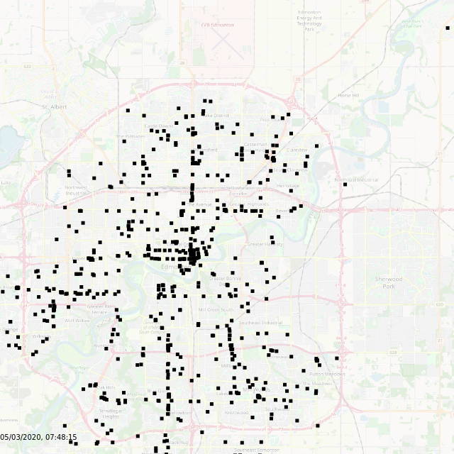
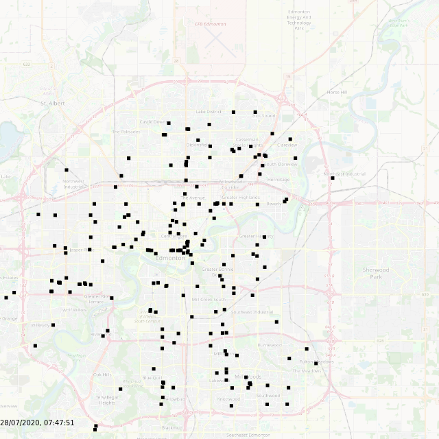

# Bus

This is a simple project I did this evening to read Edmonton bus data
from a database and present it in a simple user interface.

## Demo

Visit http://bus.mattschlosser.me

## Background 
A few months ago, before the pandmic hit, I started to log data from my city's (Edmonton, AB) GTFS feed. This includes
the time/date and GPS coordinates of each active bus in the transit system. The city provides an API
to get the current location of buses. I set up a script back in Feburary to pull the data every minute or so and 
save it into an SQLite database. 

I finally sat down and took some time to visiualize some of the 
data. I was interested in doing side-by-side comparisons of pre-pandemic vs pandemic bus activity. 
However, my script for logging the data seems to have crashed multiple times as I did not pay much attention
to it. However, there was still some excelent data to do some comparisons with. 

Data is available between approximately the following dates:
* Feb 21, 2020 - March 15, 2020
* May 19, 2020 - May 31, 2020
* July 4, 2020 - Present

Here is a comparison between two dates that shows the difference between pre-pandemic and current (July 28) service.




## Backend

 I created a simple server for sending bus data to the client
based on a time interval.


Users can query all bus locations stored under the `bus.db` file with
a request like 
```
http://localhost:8080/bus/2020-05-22/14:50/2
```

e.g. http://bus.mattschlosser.me/bus/2020-05-22/14:50/2 will return the data of all
buses on March 22, 2020 between 2:48 and 2:52 pm
The '2' indicates a 2 minute spread on either side. It can be adjusted between 1 - 5. 
This is useful for displaying data in a time sequence fashion.

## Frontend

Visit `http://localhost:8080/`

Here, the data is presented in a map like view. Users can see the location of
the bus and see updated location in half minute intervals

The interface is still a work in progress. I have added a map and some interface controls so the
user can pick the date and time. 

## Future ideas:
* Replay the day
  - Watch the activity of all buses for a single day. 
* Track my bus
  - Track a physical bus throughout the day. For example, the 3 becomes the 
* Machine learning
  - Compare against the GTFS schedule and see
    - Are there any buses which are typically early?
    - Are there any buses which are typically late?
 

## Setup

Create a sqlite db named `bus.db` with the following schema


```sql
CREATE TABLE pos(id integer primary key autoincrement, bus integer, lat double, long double, trip int, timestamp timestamp, bearing int, speed double);
CREATE INDEX ts on pos(timestamp);
```

Here is where data about buses should be stored. 

Due to large file size, the `bus.db` file I have cannot be uploaded to GitHub. However, you can [try the demo](http://bus.mattschlosser.me/) to see the interface and use the API.

You can also make your own database by querying [a GTFS service](https://developers.google.com/transit/gtfs-realtime) and writing the data into the database 

Once you have collected some data into your database, you will be able to visiualize it by.

1. Clonning the repo 

2. Running `npm install`

3. Ensuring your `bus.db` sqlite3 db is in the root of the project

4. Running `node . `

5. Visit `http://localhost:8080`
